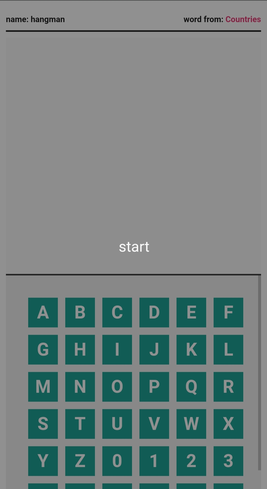
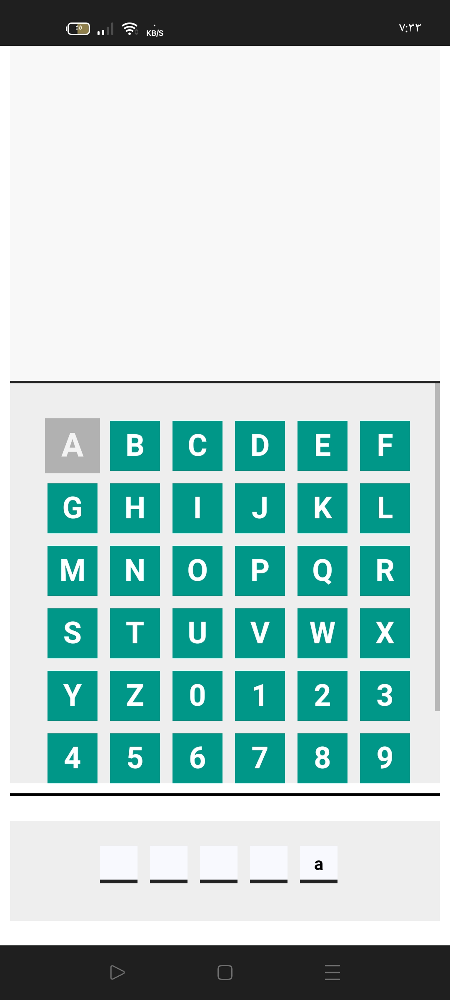
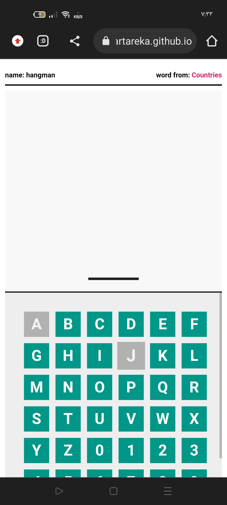
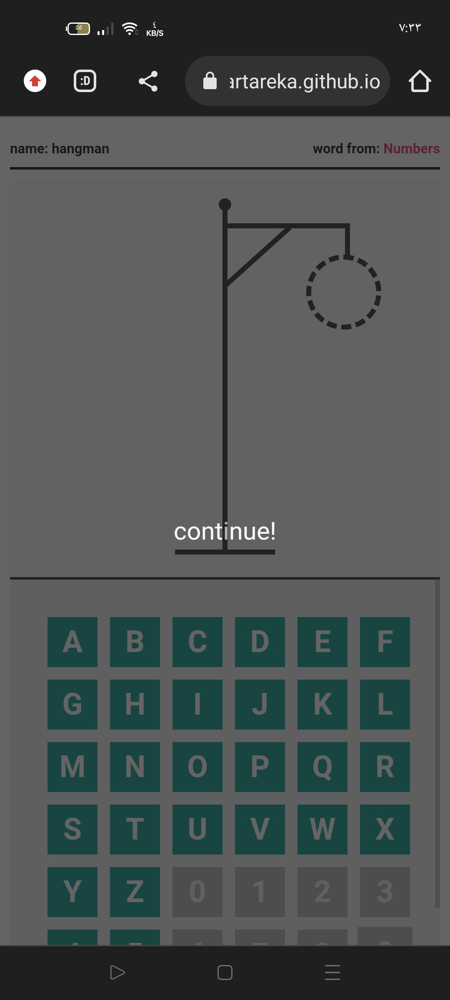
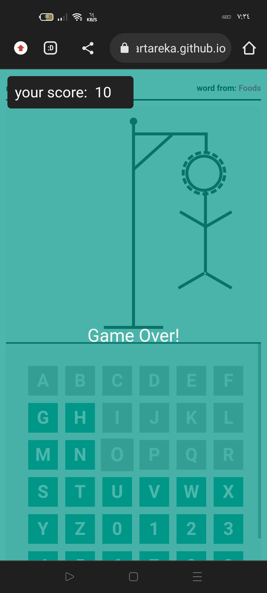
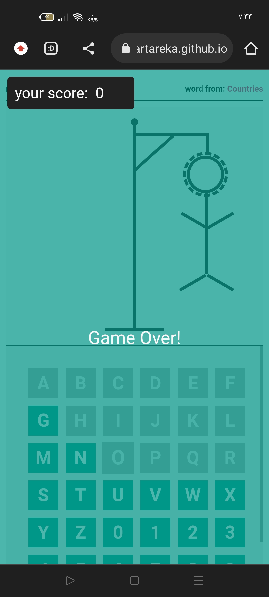
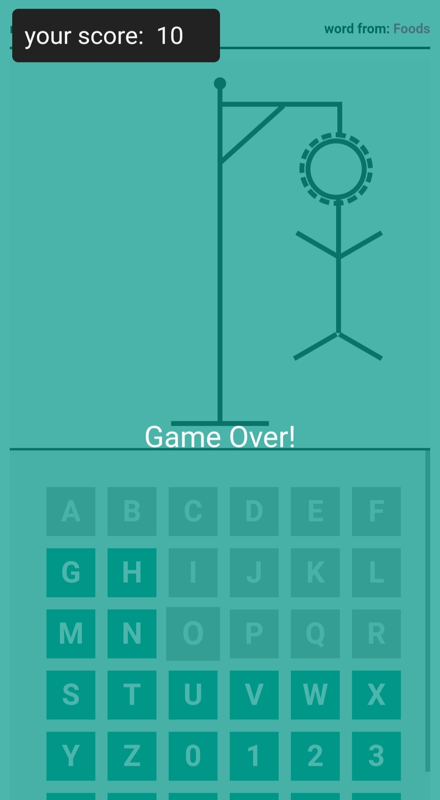

# HangMan-Game
### HangMan-Game With Javascript
### Description:-

The hangman game select word by random and you will see the  category of this word your task to compelete the empty boxs by guessing the word.
game will start with layout you should click on the start button to start it after it you will get by random way a word 
you should guess that word when you click on the letters box the letter will be disabled as it is the wrong letter.

### steps of the game:-
##### click enter on start button
##### you will see the category of the random word at the top right
##### you should guess the correct word by see the number of box at the bottom (the size of the word)
##### when you chose the wrong letter the letter will be disabled and the hangman drow will be shown
##### if you solve and get the correct word you will continue ad you score will be stored in the localstortage you will  
you will get it when the hangman be full
###### if the hangman be drown you re losen and you will get score 0
## shapes of game:-
#####  first:-
#### 
#####  second:-
#### 
#####  third:-
#### 
#####  fourth:-
#### 
#####  fifth:-
#### 
#####  sixth:-
#### 
#####  seventh:-
#### 
### the link of the game:-
[Click](https://anwartareka.github.io/HangMan-Game/)
